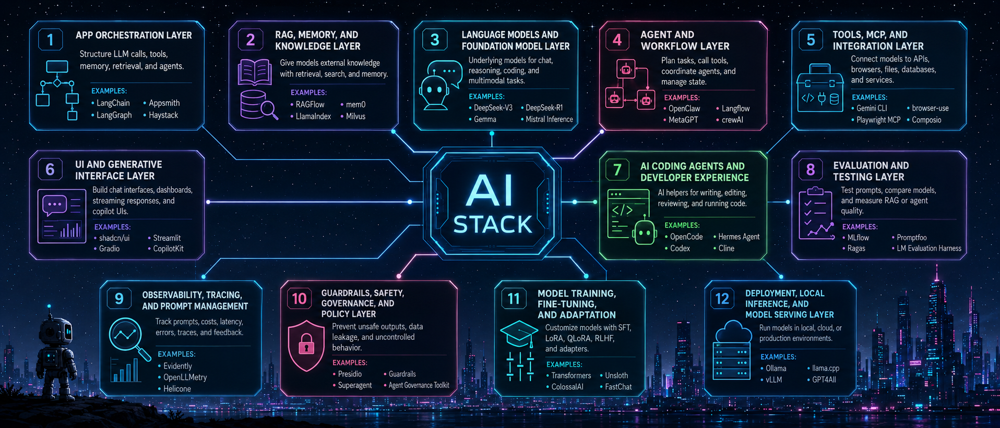

# Trending AI projects list

A curated overview of the top open-source AI repositories, organised by category. Each section covers a distinct layer of the modern AI stack — from orchestration frameworks and RAG pipelines to coding agents, evaluation tooling, and model serving infrastructure.
This list is subject to change and will be updated regularly.

*Maintained at [bobpage0451/ai-trending-repos](https://github.com/bobpage0451/ai-trending-repos) • Last updated: 2026-05-27 (refreshed bi-weekly)*

- [App orchestration layer](#app-orchestration-layer)
- [RAG, memory, and knowledge layer](#rag-memory-and-knowledge-layer)
- [Language models and foundation model layer](#language-models-and-foundation-model-layer)
- [Agent and workflow layer](#agent-and-workflow-layer)
- [Tools, MCP, and integration layer](#tools-mcp-and-integration-layer)
- [UI and generative interface layer](#ui-and-generative-interface-layer)
- [AI coding agents and developer experience](#ai-coding-agents-and-developer-experience)
- [Evaluation and testing layer](#evaluation-and-testing-layer)
- [Observability, tracing, and prompt management](#observability-tracing-and-prompt-management)
- [Guardrails, safety, governance, and policy layer](#guardrails-safety-governance-and-policy-layer)
- [Model training, fine-tuning, and adaptation](#model-training-fine-tuning-and-adaptation)
- [Deployment, local inference, and model serving layer](#deployment-local-inference-and-model-serving-layer)

---

## App orchestration layer

This is the core application framework layer for building AI apps. It helps structure LLM calls, chains, workflows, tool use, retrieval, memory, callbacks, and agent execution.

Connect prompts, models, tools, memory, retrieval, agents, and workflows.

| Repository | ⭐ Stars | 🍴 Forks | License | Language |
|---|---|---|---|---|
| [langchain-ai/langchain](https://github.com/langchain-ai/langchain) | 137.8k | 22821 |  |  |
| [appsmithorg/appsmith](https://github.com/appsmithorg/appsmith) | 39.9k | 4580 |  |  |
| [langchain-ai/langgraph](https://github.com/langchain-ai/langgraph) | 33.1k | 5594 |  |  |
| [deepset-ai/haystack](https://github.com/deepset-ai/haystack) | 25.4k | 2810 |  | MDX |
| [langchain-ai/deepagents](https://github.com/langchain-ai/deepagents) | 23.4k | 3310 |  |  |
| [google/adk-python](https://github.com/google/adk-python) | 19.9k | 3465 |  |  |
| [Chainlit/chainlit](https://github.com/Chainlit/chainlit) | 12.1k | 1712 |  |  |
| [microsoft/agent-framework](https://github.com/microsoft/agent-framework) | 10.8k | 1786 |  |  |
| [InternLM/lagent](https://github.com/InternLM/lagent) | 2.3k | 231 |  |  |
| [run-llama/llama-agents](https://github.com/run-llama/llama-agents) | 381 | 66 |  |  |

## RAG, memory, and knowledge layer

This layer includes retrieval-augmented generation, semantic search, embeddings, vector storage, hybrid search, reranking, citations, document permissions, and short-term or long-term memory.

Give the model external, project, user, or company knowledge.

| Repository | ⭐ Stars | 🍴 Forks | License | Language |
|---|---|---|---|---|
| [infiniflow/ragflow](https://github.com/infiniflow/ragflow) | 81.4k | 9329 |  |  |
| [mem0ai/mem0](https://github.com/mem0ai/mem0) | 56.9k | 6486 |  |  |
| [MemPalace/mempalace](https://github.com/MemPalace/mempalace) | 52.9k | 6980 |  |  |
| [run-llama/llama_index](https://github.com/run-llama/llama_index) | 49.7k | 7468 |  |  |
| [milvus-io/milvus](https://github.com/milvus-io/milvus) | 44.5k | 4026 |  |  |
| [VectifyAI/PageIndex](https://github.com/VectifyAI/PageIndex) | 32.2k | 2776 |  |  |
| [qdrant/qdrant](https://github.com/qdrant/qdrant) | 31.6k | 2298 |  |  |
| [chroma-core/chroma](https://github.com/chroma-core/chroma) | 28.1k | 2274 |  |  |
| [weaviate/weaviate](https://github.com/weaviate/weaviate) | 16.2k | 1298 |  |  |
| [memvid/memvid](https://github.com/memvid/memvid) | 15.6k | 1344 |  |  |

## Language models and foundation model layer

This layer includes proprietary, open-weight, and local language models used for chat, reasoning, coding, embeddings, multimodal tasks, and agentic workflows. It covers model families such as OpenAI GPT, Anthropic Claude, Google Gemini and Gemma, Meta Llama, Mistral, DeepSeek, Qwen, Cohere, GitHub Models, and other foundation models.

Choose, compare, and use the underlying language models that power AI applications.

| Repository | ⭐ Stars | 🍴 Forks | License | Language |
|---|---|---|---|---|
| [deepseek-ai/DeepSeek-V3](https://github.com/deepseek-ai/DeepSeek-V3) | 103.6k | 16744 |  |  |
| [deepseek-ai/DeepSeek-R1](https://github.com/deepseek-ai/DeepSeek-R1) | 92k | 11728 |  | N/A |
| [google-deepmind/gemma](https://github.com/google-deepmind/gemma) | 5.3k | 937 |  |  |

## Agent and workflow layer

This layer covers tool-using agents, graph-based workflows, planner-executor patterns, multi-agent collaboration, human approval steps, state management, retries, and long-running task execution.

Build systems that can plan, call tools, perform multi-step tasks, and coordinate agents.

| Repository | ⭐ Stars | 🍴 Forks | License | Language |
|---|---|---|---|---|
| [openclaw/openclaw](https://github.com/openclaw/openclaw) | 375k | 78185 |  |  |
| [langflow-ai/langflow](https://github.com/langflow-ai/langflow) | 148.8k | 9128 |  |  |
| [bytedance/deer-flow](https://github.com/bytedance/deer-flow) | 69.8k | 9400 |  |  |
| [FoundationAgents/MetaGPT](https://github.com/FoundationAgents/MetaGPT) | 68.3k | 8705 |  |  |
| [crewAIInc/crewAI](https://github.com/crewAIInc/crewAI) | 52.3k | 7264 |  |  |
| [agno-agi/agno](https://github.com/agno-agi/agno) | 40.4k | 5429 |  |  |
| [OpenBMB/ChatDev](https://github.com/OpenBMB/ChatDev) | 33.2k | 4122 |  |  |
| [huggingface/smolagents](https://github.com/huggingface/smolagents) | 27.5k | 2618 |  |  |
| [openai/openai-agents-python](https://github.com/openai/openai-agents-python) | 26.7k | 4108 |  |  |
| [letta-ai/letta](https://github.com/letta-ai/letta) | 23k | 2450 |  |  |

## Tools, MCP, and integration layer

This layer includes Model Context Protocol servers and clients, tool schemas, function calling, API connectors, filesystem access, browser access, database access, and integrations with services like GitHub, Slack, Google Drive, and internal tools.

Let models and agents interact with external systems, APIs, databases, files, and tools.

| Repository | ⭐ Stars | 🍴 Forks | License | Language |
|---|---|---|---|---|
| [google-gemini/gemini-cli](https://github.com/google-gemini/gemini-cli) | 104.7k | 13895 |  |  |
| [browser-use/browser-use](https://github.com/browser-use/browser-use) | 95.8k | 10784 |  |  |
| [microsoft/playwright-mcp](https://github.com/microsoft/playwright-mcp) | 33.1k | 2717 |  |  |
| [ComposioHQ/composio](https://github.com/ComposioHQ/composio) | 28.5k | 4589 |  |  |
| [PrefectHQ/fastmcp](https://github.com/PrefectHQ/fastmcp) | 25.3k | 2034 |  |  |
| [microsoft/mcp-for-beginners](https://github.com/microsoft/mcp-for-beginners) | 16.2k | 5299 |  |  |
| [Netflix/metaflow](https://github.com/Netflix/metaflow) | 10.1k | 1279 |  |  |
| [mcp-use/mcp-use](https://github.com/mcp-use/mcp-use) | 10k | 1303 |  |  |
| [steel-dev/steel-browser](https://github.com/steel-dev/steel-browser) | 7.1k | 933 |  |  |
| [firecrawl/firecrawl-mcp-server](https://github.com/firecrawl/firecrawl-mcp-server) | 6.4k | 733 |  |  |

## UI and generative interface layer

This layer is more than normal frontend. It includes chat UIs, streaming responses, agent dashboards, tool-call displays, generated UI, copilot components, diff viewers, file attachments, code previews, and human approval interfaces.

Build the user-facing interface for AI applications.

| Repository | ⭐ Stars | 🍴 Forks | License | Language |
|---|---|---|---|---|
| [shadcn-ui/ui](https://github.com/shadcn-ui/ui) | 115.1k | 8926 |  |  |
| [streamlit/streamlit](https://github.com/streamlit/streamlit) | 44.7k | 4262 |  |  |
| [gradio-app/gradio](https://github.com/gradio-app/gradio) | 42.7k | 3481 |  |  |
| [CopilotKit/CopilotKit](https://github.com/CopilotKit/CopilotKit) | 31.8k | 4109 |  |  |
| [microsoft/semantic-kernel](https://github.com/microsoft/semantic-kernel) | 28k | 4608 |  |  |
| [tambo-ai/tambo](https://github.com/tambo-ai/tambo) | 11.1k | 568 |  |  |
| [huggingface/chat-ui](https://github.com/huggingface/chat-ui) | 10.7k | 1647 |  |  |
| [richardgill/llm-ui](https://github.com/richardgill/llm-ui) | 1.7k | 89 |  |  |

## AI coding agents and developer experience

This category includes AI coding assistants, autonomous coding agents, repo-editing agents, terminal agents, IDE extensions, pair programmers, code review tools, and systems that inspect, modify, test, and explain codebases.

Help developers write, edit, review, understand, and run code with AI.

| Repository | ⭐ Stars | 🍴 Forks | License | Language |
|---|---|---|---|---|
| [NousResearch/hermes-agent](https://github.com/NousResearch/hermes-agent) | 169.8k | 28331 |  |  |
| [anomalyco/opencode](https://github.com/anomalyco/opencode) | 166.1k | 19744 |  |  |
| [openai/codex](https://github.com/openai/codex) | 86.3k | 12614 |  |  |
| [JuliusBrussee/caveman](https://github.com/JuliusBrussee/caveman) | 65.5k | 3695 |  |  |
| [cline/cline](https://github.com/cline/cline) | 62.4k | 6550 |  |  |
| [Aider-AI/aider](https://github.com/Aider-AI/aider) | 45.4k | 4494 |  |  |
| [continuedev/continue](https://github.com/continuedev/continue) | 33.4k | 4568 |  |  |
| [SWE-agent/SWE-agent](https://github.com/SWE-agent/SWE-agent) | 19.3k | 2102 |  |  |

## Evaluation and testing layer

This layer includes prompt tests, regression tests, model comparisons, RAG evaluation, hallucination checks, LLM-as-judge metrics, agent task success evaluation, red-team tests, and CI/CD quality gates.

Measure whether an AI app, prompt, RAG pipeline, model, or agent is improving or getting worse.

| Repository | ⭐ Stars | 🍴 Forks | License | Language |
|---|---|---|---|---|
| [mlflow/mlflow](https://github.com/mlflow/mlflow) | 26.1k | 5787 |  |  |
| [promptfoo/promptfoo](https://github.com/promptfoo/promptfoo) | 21.7k | 1904 |  |  |
| [vibrantlabsai/ragas](https://github.com/vibrantlabsai/ragas) | 14.1k | 1446 |  |  |
| [EleutherAI/lm-evaluation-harness](https://github.com/EleutherAI/lm-evaluation-harness) | 12.7k | 3294 |  |  |
| [NVIDIA/garak](https://github.com/NVIDIA/garak) | 7.9k | 970 |  |  |
| [truera/trulens](https://github.com/truera/trulens) | 3.3k | 281 |  |  |
| [huggingface/lighteval](https://github.com/huggingface/lighteval) | 2.4k | 473 |  |  |
| [msoedov/agentic_security](https://github.com/msoedov/agentic_security) | 1.9k | 258 |  |  |

## Observability, tracing, and prompt management

This layer gives visibility into what happened inside an AI system. It includes tracing, span trees, prompt logs, completion logs, token usage, cost monitoring, feedback capture, prompt versioning, and evaluation dashboards.

Track prompts, completions, costs, latency, errors, tool calls, traces, retrieved context, and feedback.

| Repository | ⭐ Stars | 🍴 Forks | License | Language |
|---|---|---|---|---|
| [evidentlyai/evidently](https://github.com/evidentlyai/evidently) | 7.5k | 853 |  |  |
| [traceloop/openllmetry](https://github.com/traceloop/openllmetry) | 7.1k | 978 |  |  |
| [Helicone/helicone](https://github.com/Helicone/helicone) | 5.7k | 590 |  |  |

## Guardrails, safety, governance, and policy layer

This layer includes input and output filters, PII detection, jailbreak and prompt-injection defenses, safe tool calling, policy engines, human approvals, governance, compliance, audit logs, and red-team testing.

Prevent harmful outputs, unsafe tool calls, prompt injection, data leakage, and uncontrolled agent behavior.

| Repository | ⭐ Stars | 🍴 Forks | License | Language |
|---|---|---|---|---|
| [microsoft/presidio](https://github.com/microsoft/presidio) | 8.3k | 1077 |  |  |
| [guardrails-ai/guardrails](https://github.com/guardrails-ai/guardrails) | 6.9k | 613 |  |  |
| [superagent-ai/superagent](https://github.com/superagent-ai/superagent) | 6.6k | 958 |  |  |
| [microsoft/agent-governance-toolkit](https://github.com/microsoft/agent-governance-toolkit) | 2.9k | 460 |  |  |
| [agentcontrol/agent-control](https://github.com/agentcontrol/agent-control) | 252 | 36 |  |  |

## Model training, fine-tuning, and adaptation

For most app builders, this is not the first layer to learn, but it is part of the full picture. It includes supervised fine-tuning, LoRA, QLoRA, PEFT, DPO, RLHF, instruction tuning, adapter training, dataset formatting, and model export.

Customize models when prompting, RAG, and tool use are not enough.

| Repository | ⭐ Stars | 🍴 Forks | License | Language |
|---|---|---|---|---|
| [huggingface/transformers](https://github.com/huggingface/transformers) | 161k | 33337 |  |  |
| [unslothai/unsloth](https://github.com/unslothai/unsloth) | 65.2k | 5796 |  |  |
| [hpcaitech/ColossalAI](https://github.com/hpcaitech/ColossalAI) | 41.4k | 4504 |  |  |
| [lm-sys/FastChat](https://github.com/lm-sys/FastChat) | 39.5k | 4788 |  |  |
| [microsoft/onnxruntime](https://github.com/microsoft/onnxruntime) | 20.7k | 3943 |  |  |

## Deployment, local inference, and model serving layer

This layer includes local model runners, inference servers, OpenAI-compatible local APIs, high-throughput serving, GPU inference, batching, quantization, autoscaling, Kubernetes deployment, and model-serving infrastructure.

Run models and AI services reliably in local, cloud, or production environments.

| Repository | ⭐ Stars | 🍴 Forks | License | Language |
|---|---|---|---|---|
| [ollama/ollama](https://github.com/ollama/ollama) | 172.4k | 16308 |  |  |
| [ggml-org/llama.cpp](https://github.com/ggml-org/llama.cpp) | 113.3k | 18834 |  |  |
| [vllm-project/vllm](https://github.com/vllm-project/vllm) | 81.2k | 17306 |  |  |
| [nomic-ai/gpt4all](https://github.com/nomic-ai/gpt4all) | 77.4k | 8325 |  |  |
| [hiyouga/LlamaFactory](https://github.com/hiyouga/LlamaFactory) | 71.7k | 8753 |  |  |
| [mudler/LocalAI](https://github.com/mudler/LocalAI) | 46.5k | 4105 |  |  |
| [ray-project/ray](https://github.com/ray-project/ray) | 42.7k | 7618 |  |  |
| [deepspeedai/DeepSpeed](https://github.com/deepspeedai/DeepSpeed) | 42.4k | 4839 |  |  |
| [sgl-project/sglang](https://github.com/sgl-project/sglang) | 28.3k | 6166 |  |  |

